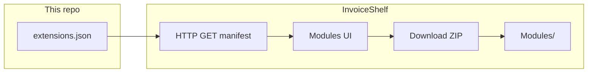

# InvoiceShelf extension catalog — developer guide

This document is the **authoritative reference** for:

1. How InvoiceShelf loads extension metadata  
2. The **`extensions.json`** manifest format  
3. How to **package** a module ZIP that installs correctly  
4. How to **publish** a new version and list it in this catalog  

For building modules inside Laravel, see the **[Module development guide](https://github.com/InvoiceShelf/InvoiceShelf/blob/main/docs/modules-development.md)** in the InvoiceShelf repository (`nwidart/laravel-modules`, `Modules/`, admin assets, menus). For general setup, see the [developer guide](https://docs.invoiceshelf.com/developer-guide.html).

**PDF templates** (invoice & estimate Blade packs) use a separate manifest: **[TEMPLATES.md](TEMPLATES.md)** and root **`templates.json`** (same Admin → Modules installer).

---

## Table of contents

1. [How the catalog is consumed](#how-the-catalog-is-consumed)
2. [Manifest file structure](#manifest-file-structure)
3. [Field reference](#field-reference)
4. [Slug and module name](#slug-and-module-name)
5. [Compatibility with InvoiceShelf versions](#compatibility-with-invoiceshelf-versions)
6. [Download URL and releases](#download-url-and-releases)
7. [ZIP package layout](#zip-package-layout)
8. [End-to-end publishing workflow](#end-to-end-publishing-workflow)
9. [PR checklist](#pr-checklist)
10. [Self-hosted manifest](#self-hosted-manifest)
11. [Security and expectations](#security-and-expectations)
12. [Troubleshooting](#troubleshooting)

---

## How the catalog is consumed

InvoiceShelf reads a **single JSON document** from a configurable URL.

- **Default URL:** `https://raw.githubusercontent.com/InvoiceShelf/extensions/main/extensions.json`
- **Override (self-hosted):** set `INVOICESHELF_EXTENSIONS_MANIFEST_URL` in the InvoiceShelf `.env` to your own HTTPS URL returning the same JSON shape.

The application:

1. Fetches JSON over HTTP(S) with a short timeout.  
2. Normalizes the payload (supports either `{ "extensions": [ ... ] }` or a bare array).  
3. Maps each row to the in-app store (name, description, install state, update availability).  
4. On **install**, downloads the ZIP from `download_url`, extracts it under `Modules/`, runs migrations and seeds, and enables the module.

If the manifest cannot be loaded, the UI may show an **extensions catalog unavailable** state.



---

## Manifest file structure

The canonical shape is a JSON object with an **`extensions`** array:

```json
{
  "extensions": [
    {
      "slug": "example",
      "module_name": "Example",
      "name": "Example",
      "description": "Short description for the store listing.",
      "version": "1.0.0",
      "author": "Your Name",
      "license": "MIT",
      "tags": ["utility"],
      "compatibility": {
        "min_version": "1.3.0",
        "max_version": "99.0.0"
      },
      "repository": "https://github.com/you/module-example",
      "download_url": "https://github.com/you/module-example/releases/download/v1.0.0/Example.zip",
      "cover": "https://raw.githubusercontent.com/you/module-example/main/preview.png"
    }
  ]
}
```

- Use **UTF-8** encoding.  
- Prefer **2-space** indentation to match existing files.  
- Keep **`extensions` as a JSON array** (ordered list); duplicates by `slug` are confusing—use a single entry per extension.

---

## Field reference

| Field | Required | Type | Description |
| ----- | -------- | ---- | ----------- |
| `slug` | Recommended | string | Stable URL-safe identifier (lowercase, hyphens). Used as the store id. If omitted, the app may derive a slug from `repository` or `name`. **Set explicitly** to avoid accidental renames. |
| `module_name` | Recommended | string | **Laravel module name** as registered by `nwidart/laravel-modules` (typically **StudlyCase**, e.g. `Payments`, `WhiteLabel`). Must match the `name` field inside the module’s `module.json` and the folder under `Modules/<module_name>/`. Used for install/update matching. |
| `name` | Yes | string | Human-readable title in the store. |
| `description` | Yes | string | Short summary (shown in listings). |
| `version` | Yes | string | **Semantic version** of the **ZIP** at `download_url`. Must match what you ship; install/update logic compares this to the installed version. |
| `author` | Recommended | string | Person or organization name. |
| `license` | Recommended | string | SPDX or common id (e.g. `MIT`, `AGPL-3.0`). |
| `tags` | Optional | string[] | Keywords for filtering/display. |
| `compatibility` | Recommended | object | See [Compatibility](#compatibility-with-invoiceshelf-versions). |
| `compatibility.min_version` | Optional | string | Minimum **InvoiceShelf** app version (inclusive). |
| `compatibility.max_version` | Optional | string | Maximum **InvoiceShelf** app version (inclusive). |
| `repository` | Recommended | string | Public Git URL (source, issues, license). |
| `download_url` | Yes | string | **Direct HTTPS** link to a **.zip** file. Must not require login; redirects are followed. |
| `cover` | Optional | string | HTTPS URL to a **preview image** (e.g. PNG/JPG) for the store card. |

---

## Slug and module name

**Slug**

- Use **kebab-case** in the catalog (`payments`, `white-label`).  
- Stable over time; changing slug effectively creates a “new” extension in the UI.

**Module name**

- Must match the **nwidart** module: directory `Modules/<module_name>/` and `module.json` → `"name": "<module_name>"`.  
- Examples from the official catalog: `Payments`, `WhiteLabel`.  
- The installer resolves the downloaded package and expects **`module.json`** to declare the same `name` as `module_name` in the manifest.

If `module_name` is omitted in JSON, the consumer may derive it from the slug (StudlyCase). **Prefer setting `module_name` explicitly** to avoid ambiguity.

---

## Compatibility with InvoiceShelf versions

The app compares the **running InvoiceShelf version** (from settings or `version.md`) against `compatibility.min_version` and `compatibility.max_version` using PHP’s `version_compare`.

- Set **`min_version`** to the **oldest InvoiceShelf release** your extension supports.  
- Set **`max_version`** high enough for future lines (e.g. `99.0.0`) unless you know a breaking upper bound.  
- **Update availability** in the UI also respects compatibility: users outside the range may not be offered an update even if a newer ZIP exists.

---

## Download URL and releases

**Requirements**

1. **HTTPS** URL.  
2. **Direct download** of a ZIP (GitHub Release assets are ideal).  
3. **Immutable per version** — each catalog `version` should point to a **fixed** URL for that artifact; avoid “latest.zip” that changes content without a version bump.  
4. **HTTP 200** for anonymous `GET` (no API keys in query strings for public installs).

**Suggested pattern (GitHub Releases)**

- Tag: `v1.0.0`  
- Asset: `MyModule.zip`  
- URL shape:  
  `https://github.com/<org>/<repo>/releases/download/v1.0.0/MyModule.zip`

Keep **`version` in `extensions.json` identical** to the module version you released and to the ZIP contents.

---

## ZIP package layout

InvoiceShelf downloads the archive and copies extracted files into `Modules/`. The installer supports several layouts; the **recommended** one is:

```text
Modules/
  <ModuleName>/
    module.json
    composer.json
    ... (Providers, Routes, Database, Resources, etc.)
```

**`module.json`** must include a `"name"` field equal to **`module_name`** in the catalog.

**Also supported (normalized automatically):**

- Nested folder: `Modules/<ModuleName>/<ModuleName>/module.json` — contents are promoted.  
- Single module at zip root with `module.json` declaring the correct `name` — moved into `Modules/<ModuleName>/`.

**Avoid**

- Zips that contain **multiple unrelated top-level folders** without a clear `module.json`.  
- Missing **`module.json`** — installation will fail.

After extraction, the app runs **`module:migrate`**, **`module:seed`**, and **`module:enable`** for your module name.

---

## End-to-end publishing workflow

1. **Develop** your extension as a Laravel module compatible with InvoiceShelf’s stack (PHP version, Laravel, Vue integration as needed).  
2. **Tag** a release in your repository and attach **`MyModule.zip`** built from the correct `Modules/<ModuleName>/` tree.  
3. **Test** install on a staging InvoiceShelf instance (upload or manual unzip under `Modules/` if needed).  
4. **Fork** [InvoiceShelf/extensions](https://github.com/InvoiceShelf/extensions).  
5. **Edit** `extensions.json`: add or update your entry; set `version`, `download_url`, `compatibility`.  
6. **Validate** JSON and URLs (`curl -fIL <download_url>`).  
7. **Open a pull request** to `main`.  
8. After merge, the default manifest URL updates within seconds (CDN/cache may rarely delay).

---

## PR checklist

Use this before submitting:

- [ ] `extensions.json` is valid JSON.  
- [ ] New `slug` does not duplicate an existing one (unless updating the same extension).  
- [ ] `version` matches the Git tag / release asset.  
- [ ] `download_url` downloads a ZIP that installs cleanly on a fresh InvoiceShelf instance.  
- [ ] `module_name` matches `module.json` inside the ZIP.  
- [ ] `compatibility` reflects tested InvoiceShelf versions.  
- [ ] `repository` and `license` are correct.  
- [ ] `cover` (if any) is HTTPS and publicly readable.

---

## Self-hosted manifest

Organizations can host their own manifest:

1. Host a JSON file (same schema as `extensions.json`) on HTTPS.  
2. Set **`INVOICESHELF_EXTENSIONS_MANIFEST_URL`** in InvoiceShelf `.env` to that URL.  
3. Optionally combine private entries with upstream metadata by proxying/merging JSON (operationally outside this repo).

An **empty** env value falls back to the default GitHub raw URL (see `config/invoiceshelf.php` in the main app).

---

## Security and expectations

- Extensions run **with the same privileges** as the InvoiceShelf application. Only list code you trust; reviewers cannot fully audit third-party binaries in every release.  
- Do not submit manifest entries that point to **malware**, **miners**, or **undisclosed data exfiltration**.  
- Prefer **open-source** repositories so users and maintainers can review changes.  
- Report security issues through the **repository** linked in your entry or through InvoiceShelf’s security policy if the issue is in core integration.

---

## Troubleshooting

| Symptom | Things to verify |
| ------- | ----------------- |
| Extension not listed | Manifest fetch errors; custom `INVOICESHELF_EXTENSIONS_MANIFEST_URL`; JSON syntax. |
| Install fails | ZIP layout; `module.json` `name` vs `module_name`; PHP errors in `storage/logs`. |
| Wrong version detected | `version` in catalog vs installed module record; mismatch with release tag. |
| No update offered | `version` not bumped; `compatibility` excludes current InvoiceShelf version; installed version already ≥ catalog version. |

---

## Example entries

- Blank template: [`docs/examples/extension-entry.template.json`](examples/extension-entry.template.json)  
- Live catalog: [`extensions.json`](../extensions.json) in this repository (official modules such as Payments and White Label).
